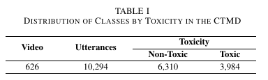
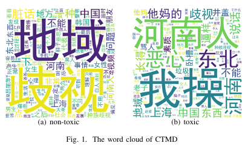
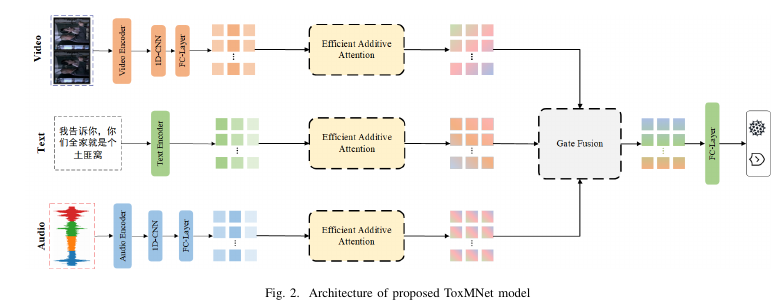
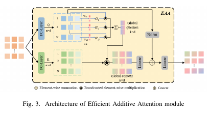

# Chinese-Toxic-Multimodal-Dataset
### THE CONSTRUCTION OF CTMD

### 1. Data Collection

We collected videos from social platforms Bilibili, Douyin, Kuaishou, and YouTube. Among these, [Douyin][https://www.douyin.com], [Bilibili][https://www.bilibili.com], and [Kuaishou][https://www.kuaishou.com] are the most popular social platforms for Chinese users, with a combined monthly active user base of 1 billion. YouTube is the world's most widely used social media platform, boasting 2.7 billion active users. To collect toxic video, we developed specialized web crawlers for the above platforms, initially limiting the data collection to content containing sensitive keywords such as regional discrimination, insults, profanity, racial discrimination, threats, and abusive language. Using these keywords, we extracted a total of 3,781 videos. The downloaded videos were processed using the [Jianying][https://www.capcut.cn] software, where we extracted and synchronized the subtitle information for each video. We then performed a rough evaluation based on whether the subtitle information contained toxic speech, ultimately retaining 626 videos. By adjusting the subtitle timestamps and modifying the text content, we aligned the subtitle, audio, and textual information, obtaining accurate sentence-level timestamps. Finally, using the [moviepy][https://github.com/Zulko/moviepy]  toolkit, we segmented the long videos into multiple sentence-level video clips based on these timestamps. This process resulted in 10,294 data entries from the 626 videos, maximizing the inclusion of toxic content.

### 2. Data Annotation

The data annotation phase of this project involved nine graduate students. We established clear criteria for determining toxicity and severity and distributed the 10,294 data entries to three groups of annotators, each consisting of three members. Each group independently manually annotated the 10,294 data entries. During the annotation process, we used 0 to indicate "non-toxic" and 1 to indicate "toxic." After completing the annotations, we aggregated the results from the three groups and summed the annotation values for each data entry, ultimately obtaining a total score ranging from 0 to 3. A score of 0 means "non-toxic" and 1, 2, and 3 mean "toxic". All annotators were required to remain impartial during the annotation process to ensure the accuracy and reliability of the data. This rigorous annotation process provided a solid foundation for subsequent data analysis and model training.

### 3. Data Statistics and Analysis

The CTMD contains a total of 10,294 entries, of which 6,310 are labeled as toxic, and the remaining 3,984 are labeled as non-toxic. Table I shows the class distribution of the CTMD. The average utterance length for each entry is approximately 12 characters, with an average duration of 2.28 seconds. In the dataset, 3,543 entries have inconsistencies between the visual and audio information, such as movie narrations, videos containing only voiceovers, and videos lacking clear body language or facial expressions. This highlights the challenges of multimodal toxicity detection based on video data.

### 4. Model

**Data Source**

[Google Driver][https://drive.google.com/file/d/1exguHLUvNUhWTllalf2LN4PHdCCMNVMC/view?usp=drive_link]

The data has been encrypted. If you are interested, please contact qzc@cqust.edu.cn. 

### 5. Warm reminder
Please note that the dataset may contain sensitive information; however, this content is not reflective of our personal views or intentions. The data is provided strictly for research purposes, and any sensitive content is included solely to facilitate accurate and comprehensive analysis in the context of toxic video detection.

